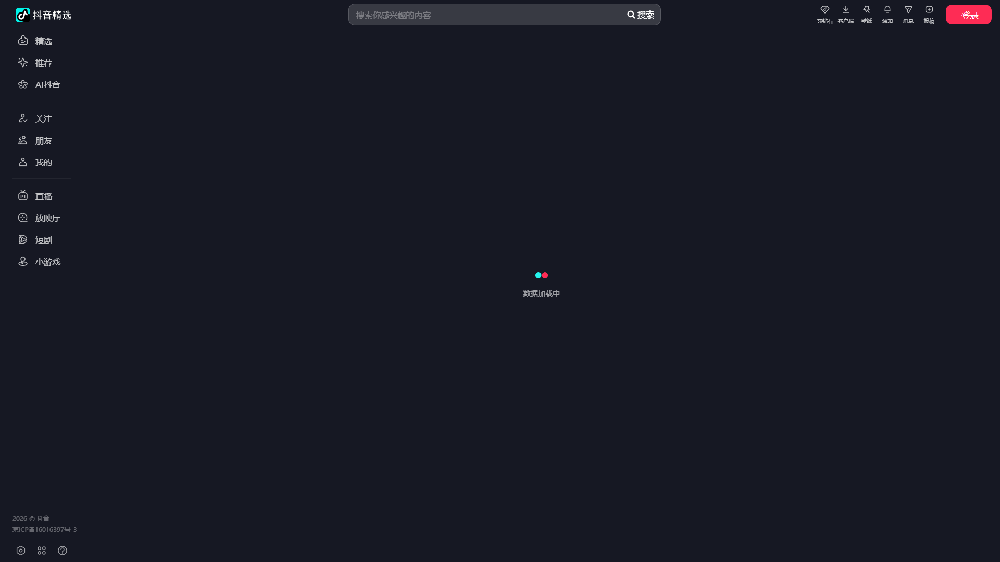

# 抖音热点监控 Agent

> 一个基于 Playwright + FFmpeg 的抖音内容采集与智能分析系统，用于音乐营销决策支持。


---

## 目录


- [项目简介](#项目简介)
- [系统架构](#系统架构)
- [模块职责](#模块职责)
- [项目结构](#项目结构)
- [快速开始](#快速开始)
- [测试验证](#测试验证)
- [数据库设计](#数据库设计)
- [核心实现细节](#核心实现细节)
- [Docker 部署](#docker-部署)
- [项目进展](#项目进展)
- [已知限制](#已知限制)
- [技术栈](#技术栈)
- [开发日志](#开发日志)
- [联系方式](#联系方式)

---

## 项目简介

本项目是一个抖音热点监控 Agent，旨在自动监控指定抖音账号的短视频内容，提取热点信息，进行结构化存储，为公司的音乐营销决策提供数据支持。

项目采用模块化架构设计，覆盖采集 → 处理 → 存储 → 调度 → 告警全链路，具备生产级工程实践。

### 核心价值

- 自动化采集：无需人工手动翻看抖音，程序自动定时采集指定账号的最新视频
- 结构化存储：将采集到的视频信息存入 SQLite 数据库，方便后续查询和分析
- 工程化保障：具备日志记录、异常捕获、重试机制等生产级工程实践
- 容器化部署：提供 Docker 支持，一键部署，环境一致

---

## 系统架构

整体流程如下：

调度器 → 采集模块 → 抖音页面 → 处理模块 → 存储模块 → SQLite 数据库
                                                    ↓
                                              日志模块 → 告警模块

流程说明：

1. 调度器 按预设时间触发采集任务
2. 采集模块 启动浏览器访问抖音，提取视频信息
3. 处理模块 对视频进行音频提取和内容分析
4. 存储模块 将数据写入 SQLite 数据库
5. 日志模块 全程记录运行状态，异常时触发告警

---

## 模块职责

| 模块 | 目录 | 职责 |
|------|------|------|
| 采集模块 | src/collector/ | 使用 Playwright 控制浏览器访问抖音，采集视频信息 |
| 处理模块 | src/processor/ | 对采集到的数据进行二次处理（音频提取、内容分析） |
| 存储模块 | src/storage/ | 负责数据的持久化，使用 SQLite 存储视频和任务日志 |
| 调度模块 | src/scheduler/ | 管理定时任务和重试机制，确保任务可靠执行 |
| 工具模块 | src/utils/ | 提供日志记录、告警通知等通用服务 |

---

## 📂 项目结构

```text
douyin-monitor/
├── src/
│   ├── __init__.py
│   ├── collector/              # 采集模块
│   │   ├── __init__.py
│   │   └── douyin.py           # 抖音页面操作 + 浏览器管理
│   ├── processor/              # 处理模块
│   │   ├── __init__.py
│   │   ├── audio.py            # FFmpeg 音频提取
│   │   └── analyzer.py         # 内容分析
│   ├── storage/                # 存储模块
│   │   ├── __init__.py
│   │   ├── db.py               # SQLite 操作
│   │   └── models.py           # 数据模型
│   ├── scheduler/              # 调度模块
│   │   ├── __init__.py
│   │   └── tasks.py            # 定时任务与重试
│   └── utils/                  # 工具模块
│       ├── __init__.py
│       ├── logger.py           # 日志配置
│       └── alert.py            # 告警通知
├── docs/
│   └── debug_page.png
├── data/
├── logs/
├── tests/
├── main.py
├── Dockerfile
├── docker-compose.yml
├── requirements.txt
├── LICENSE
└── README.md
```

## 快速开始

### 环境要求

| 依赖 | 版本要求 |
|------|---------|
| Python | 3.10+ |
| Playwright | 1.40+ |
| FFmpeg | 5.0+ |
| Docker | 24.0+ |
| WSL 2 | Windows 下必需 |

### 安装步骤

第一步，克隆项目：

    git clone https://github.com/xieyn9988/douyin-monitor.git
    cd douyin-monitor

第二步，安装 Python 依赖：

    pip install -r requirements.txt

第三步，安装 Playwright 浏览器：

    playwright install chromium

第四步，运行主程序：

    python main.py

---

## 测试验证

| 测试脚本 | 验证内容 | 运行命令 |
|---------|---------|---------|
| test_browser.py | Playwright 能否启动浏览器 | python tests/test_browser.py |
| test_douyin.py | 能否访问抖音页面 | python tests/test_douyin.py |
| test_db.py | 数据库读写是否正常 | python tests/test_db.py |
| test_phase1.py | 集成测试（采集 → 存储） | python tests/test_phase1.py |

*--运行前请确保已完成「快速开始」中的环境安装步骤--*

---

## 数据库设计

### videos 表（视频信息）

| 字段 | 类型 | 说明 |
|------|------|------|
| id | TEXT | 视频唯一标识（主键） |
| user_id | TEXT | 抖音用户 ID |
| title | TEXT | 视频标题 |
| url | TEXT | 视频链接 |
| cover_url | TEXT | 封面图链接 |
| audio_path | TEXT | 提取的音频文件路径 |
| duration | REAL | 视频时长（秒） |
| created_at | TIMESTAMP | 采集时间 |
| processed | INTEGER | 是否已处理（0/1） |

### task_logs 表（任务日志）

| 字段 | 类型 | 说明 |
|------|------|------|
| id | INTEGER | 自增主键 |
| task_name | TEXT | 任务名称 |
| status | TEXT | 状态（success/failed/retry） |
| error_msg | TEXT | 错误信息 |
| retry_count | INTEGER | 重试次数 |
| created_at | TIMESTAMP | 记录时间 |

---

## 核心实现细节

### 1. 浏览器自动化采集

核心逻辑是使用 Playwright 启动浏览器，模拟真实用户访问抖音页面：

    # 初始化（只执行一次）
    collector = DouyinCollector()
    await collector.start()   # 启动 Playwright 和浏览器，创建 context

    # 每次采集时（复用同一个 context，只开新 page）
    page = await self.context.new_page()
    await page.goto(url, timeout=30000)
    await page.wait_for_timeout(random.randint(2000, 4000))

    # 采集完成后
    await page.close()        # 关页面，不关浏览器
    # 说明：浏览器只在启动时创建一次，后续每次采集复用同一个 context，仅新建 page，大幅降低资源消耗。
        

反爬策略：

- **User-Agent 轮换**：每次启动浏览器时随机选择一个 UA，模拟不同设备
- **随机延迟**：页面加载后随机等待 2~4 秒，避免请求频率过高被识别。程序启动时会立即触发一次采集任务。
- **模拟真实交互**：通过 `mouse.wheel` 模拟鼠标滚动，触发页面懒加载
- **复用浏览器上下文**：避免频繁启动/关闭浏览器留下明显特征

### 2. 任务调度与重试

使用指数退避策略，任务失败后按 1 分钟、5 分钟、15 分钟间隔重试，达到最大重试次数后发送告警。

### 3. 日志记录

使用 RotatingFileHandler，日志文件达到 10MB 自动轮转，保留 5 个备份，避免日志文件无限增长。同时日志会输出到控制台，方便实时调试。

---

## Docker 部署

### Dockerfile

    FROM python:3.10-slim
    
    # 安装系统依赖
    RUN apt-get update && apt-get install -y \
    ffmpeg \
    wget \
    && rm -rf /var/lib/apt/lists/*
    
    # 安装Playwright浏览器
    RUN pip install playwright && playwright install chromium
    
    WORKDIR /app
    COPY requirements.txt .
    RUN pip install -r requirements.txt
    
    COPY . .
    
    CMD ["python", "main.py"]

### docker-compose.yml

    version: '3.8'
    # 本项目只有一个名为 monitor 的服务。
    services:
      monitor:
        build: .
        # ${FEISHU_WEBHOOK} 会读取宿主机上同名的环境变量（通常在 .env 文件中定义，或通过 export 设置）。
        # 注意：如果宿主机没有设置这个变量，容器内该变量会为空，可能会导致程序运行异常。
        environment:
          - FEISHU_WEBHOOK=${FEISHU_WEBHOOK}
        volumes:
          - ./data:/app/data
          - ./logs:/app/logs
          # 用于缓存音频文件（避免重复下载或生成）
          - ./audio_cache:/app/audio_cache
        restart: unless-stopped

---

## 项目进展

| 阶段 | 内容 | 状态 |
|------|------|------|
| Phase 1 | 项目骨架 + 采集核心 + 数据库 | 已完成 |
| Phase 2 | FFmpeg 音视频处理 + 内容分析 | 已完成 |
| Phase 3 | 调度 + 重试 + 日志告警 | 已完成 |
| Phase 4 | Docker 部署 + 文档完善 | 已完成 |

---

## 已知限制

#### 无头浏览器被抖音识别为爬虫，访问时返回"用户不存在"页面（见下图）。



  *--后续解决方案--*：
  - 使用 `playwright-stealth` 降低浏览器指纹特征
  - 使用代理 IP 池轮换请求
  - 加入人类行为模拟（随机鼠标移动、滚动）
#### 仅监控少量账号：目前设计为监控 3-5 个账号，非大规模爬虫
#### ASR 未集成：语音识别功能暂未集成，当前使用 **jieba 中文分词 + 预定义行业词典** 做关键词匹配和情感分析。
   - 行业词典覆盖：曲风（流行/摇滚/说唱等）、情绪（治愈/伤感/励志等）、场景（翻唱/原创/合拍等）
   - 情感分析：基于正负情感词典的简单打分，不依赖大模型
#### 单机部署：目前为单机部署，未考虑分布式场景

---

## 技术栈

| 类别 | 技术 | 用途 |
|------|------|------|
| 编程语言 | Python 3.10+ | 核心开发语言 |
| 浏览器自动化 | Playwright | 页面采集 |
| 数据库 | SQLite | 数据存储 |
| 音视频处理 | FFmpeg | 音频提取 |
| 任务调度 | APScheduler | 定时任务 |
| 容器化 | Docker | 环境打包与部署 |
| AI 辅助 | Cursor / Claude Code | 代码生成与调试 |

---

## 开发日志

### Day 1：环境搭建与项目初始化

- 安装 Docker Desktop，解决 WSL 2 缺失问题
- 创建项目骨架，初始化 Git 仓库
- 编写基础模块：models.py、db.py

### Day 2：采集模块开发

- 实现 Playwright 浏览器自动化
- 编写抖音页面采集逻辑
- 解决反爬问题：UA 轮换、随机延迟

### Day 3：测试与集成

- 编写分模块测试脚本
- 运行集成测试，修复 bug
- 完成 README 文档

---

## 联系方式

- 项目维护者：[谢鹰]
- 邮箱：[420309519@qq.com]
- GitHub：https://github.com/xieyn9988

---

> 本项目为面试作品，用于展示 AI 辅助开发能力与工程化思维。
> 项目框架健康，地基扎实，随时可以依据业务需求进行迭代和扩展。
